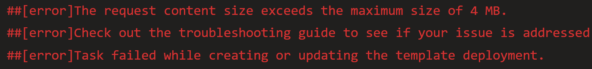
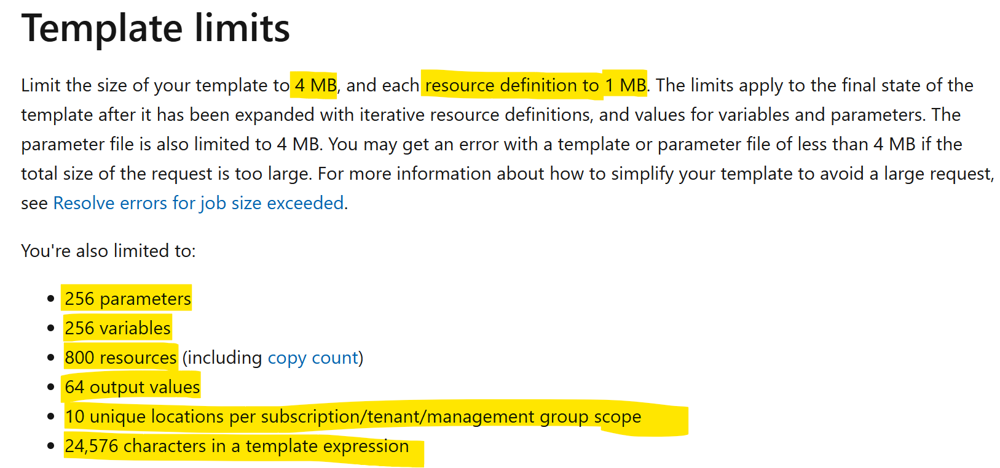

# **Why Use Data Factory (ADF) Linked Templates?**

- ADF ARM Template is **over 4 MB** in size. Example error message:

- ARM Templates have limits [ARM Template Limits](https://learn.microsoft.com/en-us/azure/azure-resource-manager/templates/best-practices)
- Additional ARM limits [Additional ARM Limits](https://learn.microsoft.com/en-us/azure/azure-resource-manager/templates/linked-templates?tabs=azure-powershell#securing-an-external-template)

## **Current Approach and Challanges**

- [Data Factory Linked Resource Template Overview](https://learn.microsoft.com/en-us/azure/data-factory/continuous-integration-delivery-linked-templates)
- [Data Factory Linked Template Steps](https://learn.microsoft.com/en-us/archive/blogs/najib/deploying-linked-arm-templates-with-vsts)

### Steps

1. Create a Storage Account (public access enabled)
2. Copy ADF Linked ARM Template files to the Storage Account
3. Create a SAS (Shared Access Signature) token on the Storage Account and set the expiration timestamp
4. Add the SAS token as a secret varible on the Azure Pipeline or store it as a Key Vault Secret and then connect to it to the Pipeline
5. Add the SAS token (or Key Vault secret) and Storage Account info to the deployment task so ARM (Azure Resource Manager) can use it to deploy the ADF Linked Templates
6. Deploy the Linked ARM Templates to the target ADF (UAT, PROD, etc.)
7. Either delete the Storage Account or wait for the SAS token to expire

### Challanges

- Storage Account has to have public access enabled (can't lock it down via firewall/private endpoints)
- SAS doesn't need to authenticate users. Whoever has a SAS token can use it to access the Storage Account
- SAS token is logged in the deployment operations even if passed as a secure string (see Additional ARM Limits link)
- No API or way to check how many SAS tokens are on a Storage Account
- No way to delete a SAS once it has been created (have to let it expire)
- Have to give elevated permissions on a Storage Account in order to create a SAS

## **New Approach Using Linked Template Specs**

### Steps (All Automated)

1. Deploy ADF Linked ARM Templates as Template Specs
2. Create new ADF Master Linked ARM Template that uses the Template Specs as Linked Template Specs
3. Deploy to the target ADF (UAT, PROD, etc.) using the Linked Template Specs
4. Optionally, delete the Template Specs after successful deployment

### Benefits

- Template Specs are RBAC secured by default
- Can version Template Specs (1.0.0.0, 1.0.0.1, etc.)
- No need to copy files to a public Storage Account or create and retrieve an SAS token
- Process is automated via the new pipeline code
